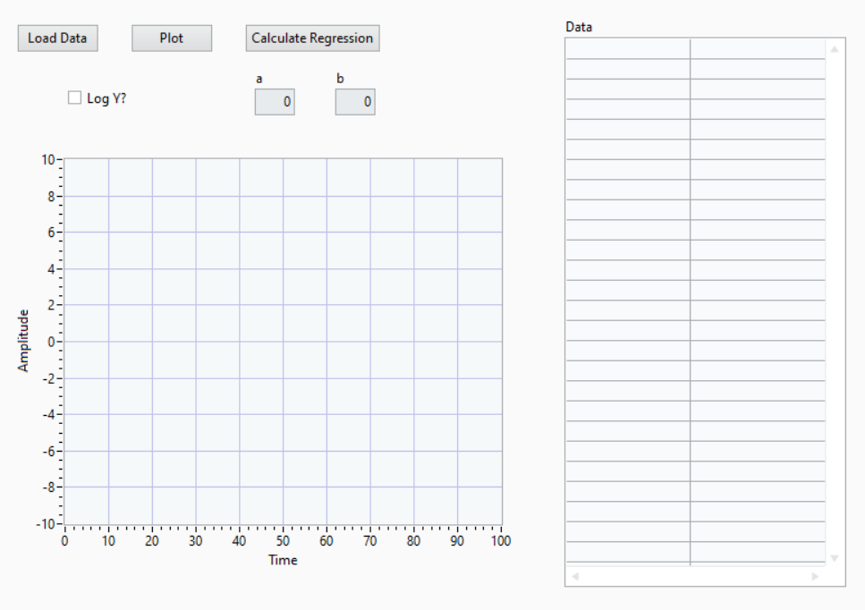

# Moduł 3 - Podstawy GUI w systemi testowym/kontroli jakości

## Wiedza/Instrukcje
- [Tkinter tutorial](https://www.pythontutorial.net/tkinter/)

## Zadanie
- W folderze `student` utwórz folder `TestingSuiteApp`
- Wykonaj (korzystając z Tkinter) aplikację o poniższych funkcjonalnościach:
    - odczyt plików CSV (separator: `;`, nagłówek: `time;value`)
    - wyświetlenie danych w tabeli (ze scrollem)
    - wyświetlanie danych na wykresie
        - przestawianie skali z liniowej na logarytmiczną
    - wyliczenie regresji liniowej (dopasowanie f-cji ax+b) 
        - wyświetlenie wartości a i b
        - wrysowanie regresji na wykresie
        - wyliczenie uruchamiane przyciskiem

## Przykładowe dane do testów
Pliki CSV znajdują się w `projekt/z-03-sample-csv/`. Wczytaj je przez dialog wyboru pliku w aplikacji.

- [linear\_a\_1\_b\_8.csv](z-03-sample-csv/linear_a_1_b_8.csv)

Szczegółowy opis plików: [z-03-sample-csv/README.md](z-03-sample-csv/README.md)
